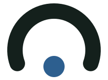

<div align="center">

<picture>
  <source media="(prefers-color-scheme: dark)" srcset="docs/assets/banner-dark.svg">
  
</picture>

<br>

**Il progetto di ricerca che fissa le garanzie per un'AI che parla dei dibattiti delle istituzioni italiane, apre i dati e ne verifica il rispetto.**

<br>


<br>

<!-- famiglia:start (keep identical across repos) -->
<table align="center">
  <tr>
    <td align="center" valign="bottom" width="160">
      <a href="https://www.parliamentrag.it">
        <picture>
          <source media="(prefers-color-scheme: dark)" srcset="docs/assets/famiglia/parliamentrag-dark.svg">
          
        </picture>
        <br><b>ParliamentRAG</b>
      </a>
      <br><sub>parliamentrag.it</sub>
    </td>
    <td align="center" valign="bottom" width="160">
      <a href="https://www.stenografo.it">
        <picture>
          <source media="(prefers-color-scheme: dark)" srcset="docs/assets/famiglia/stenografo-dark.svg">
          
        </picture>
        <br><b>Stenografo</b>
      </a>
      <br><sub>stenografo.it</sub>
    </td>
    <td align="center" valign="bottom" width="160">
      <a href="https://www.fascicoli.it">
        <picture>
          <source media="(prefers-color-scheme: dark)" srcset="docs/assets/famiglia/fascicoli-dark.svg">
          
        </picture>
        <br><b>Fascicoli</b>
      </a>
      <br><sub>fascicoli.it</sub>
    </td>
    <td align="center" valign="bottom" width="160">
      <a href="https://www.scranno.it">
        <picture>
          <source media="(prefers-color-scheme: dark)" srcset="docs/assets/famiglia/scranno-dark.svg">
          
        </picture>
        <br><b>Scranno</b>
      </a>
      <br><sub>scranno.it</sub>
    </td>
  </tr>
</table>
<!-- famiglia:end -->

</div>

<br>

## Cosa fa

ParliamentRAG è un progetto di ricerca dell'Università di Milano-Bicocca. Studia come usare l'intelligenza
artificiale sui lavori parlamentari senza perdere le fonti, e lavora su tre fronti:

- **Metodo.** Fissa i criteri che una risposta sul Parlamento deve rispettare: dare voce a tutti i gruppi,
  scegliere per ognuno chi conosce il tema, citare solo testo detto in Aula con il link al resoconto.
- **Dati.** Costruisce dagli open data ufficiali un knowledge graph della Camera dei Deputati, XIX
  legislatura, e lo pubblica intero.
- **Verifica.** Prepara un verificatore pubblico che controlla quei criteri su qualunque risposta: il
  piano è in [`docs/piano-verifica.md`](docs/piano-verifica.md).

Sullo stesso grafo lavorano tre sistemi, ognuno con un compito:

| Sistema | Cosa fa |
|---|---|
| [Stenografo](https://www.stenografo.it) | Risponde a domande sui lavori della Camera: sedute, atti, voti |
| [Fascicoli](https://www.fascicoli.it) | Riassume un tema rispettando i criteri fissati da ParliamentRAG |
| [Scranno](https://www.scranno.it) | Ti porta in prima persona nell'Aula di Montecitorio, a vedere il lavoro di ognuno di quelli che ci lavorano ogni giorno |

Questo repository contiene il sito [parliamentrag.it](https://www.parliamentrag.it), la guida al
[server MCP](docs/mcp.md) e il piano della verifica.

<table>
  <tr>
    <td width="33%" valign="top">
      <h3>Sistemi</h3>
      <code>/sistemi</code>: cosa fa ognuno dei tre sistemi e come si passano la domanda.
    </td>
    <td width="33%" valign="top">
      <h3>Pubblicazioni</h3>
      <code>/pubblicazioni</code>: i due articoli di ISWC 2026 con PDF e BibTeX, gli interventi pubblici e il link alla demo.
    </td>
    <td width="33%" valign="top">
      <h3>Metodo</h3>
      <code>/method</code>: il criterio per scegliere le fonti, i sei pesi dell'autorevolezza, il controllo delle citazioni sul resoconto.
    </td>
  </tr>
  <tr>
    <td valign="top">
      <h3>Dati aperti</h3>
      <code>/data</code>: i numeri del grafo, esempi di entità, l'allineamento ai vocabolari standard e i dump RDF.
    </td>
    <td valign="top">
      <h3>Sviluppatori</h3>
      <code>/sviluppatori</code>: il server MCP per gli assistenti AI, i dump e i dataset, le API HTTP su richiesta.
    </td>
    <td valign="top">
      <h3>Aggiornamenti</h3>
      <code>/aggiornamenti</code>: le novità del progetto e l'iscrizione alla newsletter.
    </td>
  </tr>
</table>

Completano il sito `/privacy` e `/termini`. Le vecchie pagine operative (chat, temi, timeline,
parlamentari, gruppi, classifica, bussola, ricerca) e il questionario della demo `/iswc` reindirizzano a
Fascicoli: l'elenco sta in `next.config.ts`.

<br>

## Cosa è aperto

Puoi scaricare il grafo intero, interrogarlo da un assistente AI e leggere il codice del sistema descritto
nei paper. Stenografo, Fascicoli e Scranno non sono in questa tabella.

| | Dove | Licenza |
|---|---|---|
| **Grafo in RDF** | Zenodo, [DOI 10.5281/zenodo.21560331](https://doi.org/10.5281/zenodo.21560331). Turtle, voti individuali in N-Triples a parte | CC BY-SA 4.0 |
| **Grafo in tabelle** | Hugging Face, [emeierkeio/parliamentrag-camera-leg19](https://huggingface.co/datasets/emeierkeio/parliamentrag-camera-leg19), aggiornato con i dati | CC BY-SA 4.0 |
| **Server MCP** | `https://mcp.parliamentrag.it/mcp`: interventi, sedute, votazioni voto per voto, emicicli | accesso libero |
| **Sistema di ricerca** | [Emeierkeio/parliamentrag-iswc](https://github.com/Emeierkeio/parliamentrag-iswc): pipeline dei dati, retrieval, autorevolezza, prompt. Archiviato su Zenodo, [DOI 10.5281/zenodo.23173703](https://doi.org/10.5281/zenodo.23173703) | Apache 2.0 |

I termini propri del progetto e gli URI delle entità usano il namespace persistente
`https://w3id.org/parliamentrag/`.

<br>

## Come è fatto

```
ParliamentRAG/
├── src/app/              pagine Next.js 16 (next-intl, sei lingue)
├── src/app/api/          la route della newsletter
├── src/data/             numeri del grafo ed esempi di /data, rigenerati a mano
├── messages/             testi del sito: it, en, fr, de, es, pt
├── public/               loghi, immagini dell'Aula, PDF dei paper
├── scripts/              snapshot dei dati e schermate di avvio iOS
└── docs/assets/          grafiche di questo README (build_banner.py)
```

Il sito gira senza backend e senza database. L'unica route dinamica, `/api/newsletter/subscribe`, passa
l'indirizzo a Brevo, che gestisce il doppio consenso; il sito non lo salva.

I numeri del grafo, la data dell'ultimo aggiornamento e gli esempi di `/data` stanno in
`src/data/site-data.json` e `src/data/graph-samples.json`. Prima di pubblicare li rigeneri dall'API di
ParliamentRAG:

```bash
node scripts/snapshot-data.mjs            # oppure: node scripts/snapshot-data.mjs <api_base>
```

<br>

## Avvio in locale

<details>
<summary><b>Requisiti e comandi</b></summary>

<br>

Ti servono Node 20+ e npm.

```bash
npm install
cp .env.example .env.local
npm run dev         # http://localhost:3000
```

Per la build di produzione: `npm run build` e poi `npm run start` (server Next standalone). C'è anche
`npm run lint`.

</details>

<details>
<summary><b>Variabili d'ambiente</b></summary>

<br>

In locale puoi lasciarle vuote. Il modello sta in `.env.example`.

| Variabile | Note |
|---|---|
| `BREVO_API_KEY`, `BREVO_LIST_ID`, `BREVO_DOI_TEMPLATE_ID` | newsletter; senza, il modulo non compare |
| `PUBLIC_SITE_URL` | URL pubblico, default `https://www.parliamentrag.it` |
| `NOINDEX` | `1` aggiunge `X-Robots-Tag: noindex` (anteprime) |
| `HOSTNAME` | `0.0.0.0` in produzione, serve al server standalone |

</details>

<br>

## Deploy

Progetto Railway **ParliamentRAG centro**, con il servizio `sito` collegato a GitHub, branch `main`, in
Europa (`europe-west4`, Paesi Bassi). Il database `Postgres` dello stesso progetto conserva le risposte
raccolte dal questionario prima del 6 ottobre 2026. Ogni push su `main`
ripubblica il sito. I domini `www.parliamentrag.it` e `parliamentrag.it` puntano al servizio `sito`; il
dominio senza `www` reindirizza a quello con `www`.

<br>

## Pubblicazioni

Due articoli accettati a ISWC 2026 (Bari, 25–29 ottobre 2026):

- **Who Speaks Matters: Authority-Aware Multi-View Retrieval-Augmented Generation over Italian
  Parliamentary Proceedings**. In-Use Track, LNCS 17128, cap. 24.
  [DOI 10.1007/978-3-032-42029-9_24](https://doi.org/10.1007/978-3-032-42029-9_24) ·
  [arXiv 2608.13410](https://arxiv.org/abs/2608.13410)
- **ParliamentRAG: An Authority-Aware Multi-View RAG System for Italian Parliamentary Proceedings**.
  Posters & Demos.

Il codice del sistema presentato sta in [Emeierkeio/parliamentrag-iswc](https://github.com/Emeierkeio/parliamentrag-iswc):
il tag `iswc2026-eval` è il codice delle risposte valutate nel paper, il tag `iswc2026-demo` è la versione
della demo, che risponde su
[truthful-amazement-production.up.railway.app](https://truthful-amazement-production.up.railway.app).
Zenodo archivia entrambi i tag: [DOI 10.5281/zenodo.23173703](https://doi.org/10.5281/zenodo.23173703).

> [!NOTE]
> I paper citano `github.com/Emeierkeio/ParliamentRAG`. Fino a ottobre 2026 quel nome apparteneva al
> repository del sistema di ricerca; dal 6 ottobre appartiene al sito. Il codice citato, con il tag
> `iswc2026-eval`, lo trovi in [parliamentrag-iswc](https://github.com/Emeierkeio/parliamentrag-iswc/tree/iswc2026-eval).

<details>
<summary><b>BibTeX</b></summary>

<br>

```bibtex
@inproceedings{tritella2026whospeaksmatters,
  author    = {Tritella, Mirko and Pozzi, Riccardo and Palmonari, Matteo},
  title     = {Who Speaks Matters: Authority-Aware Multi-View Retrieval-Augmented Generation over Italian Parliamentary Proceedings},
  booktitle = {Proceedings of the 25th International Semantic Web Conference (ISWC 2026), In-Use Track},
  series    = {Lecture Notes in Computer Science},
  volume    = {17128},
  publisher = {Springer},
  year      = {2026},
  doi       = {10.1007/978-3-032-42029-9_24}
}
```

</details>

Mirko Tritella, Riccardo Pozzi e Matteo Palmonari conducono il progetto all'Università di Milano-Bicocca.
Lo finanzia il programma Horizon Europe (grant [101189771](https://doi.org/10.3030/101189771), DataPACT).

<br>

<div align="center">
<sub>
Dati: Camera dei Deputati, <a href="https://creativecommons.org/licenses/by-sa/4.0/deed.it">CC BY-SA 4.0</a>.
<br>
Progetto indipendente: non è affiliato alla Camera dei Deputati e non ne rappresenta la posizione.
</sub>
</div>
